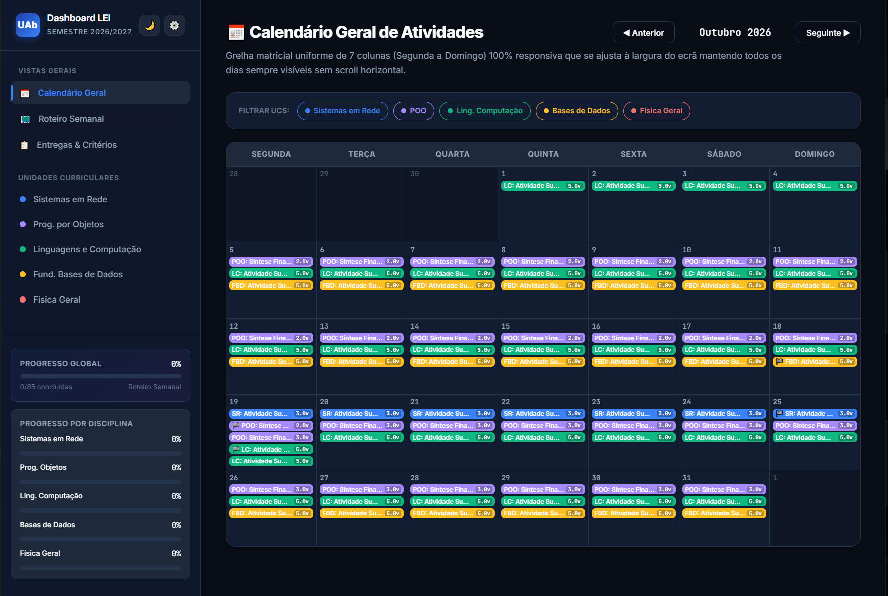
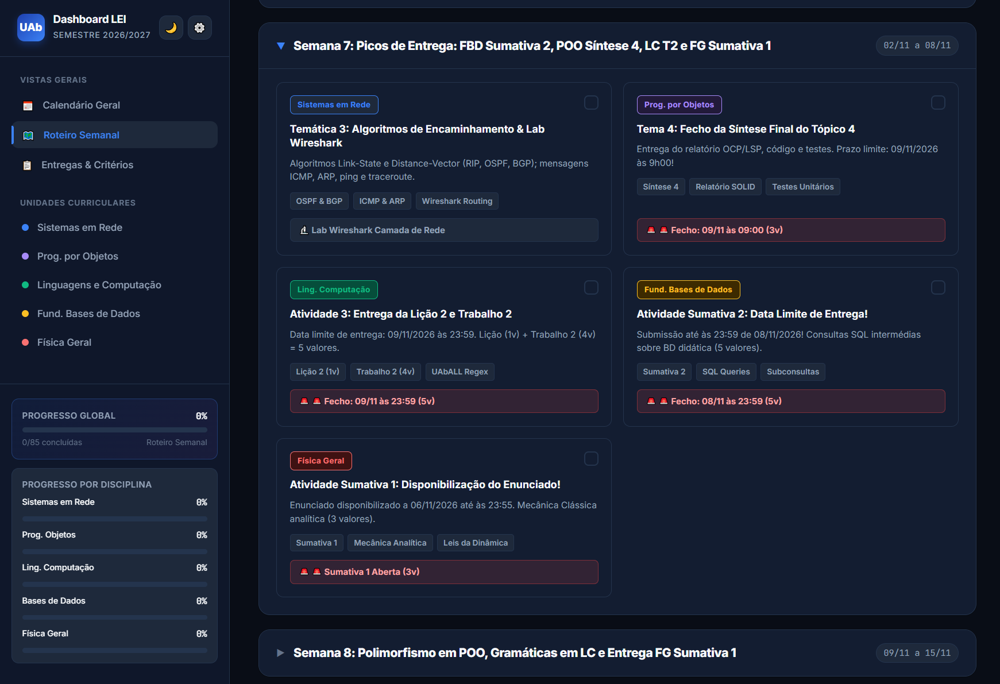
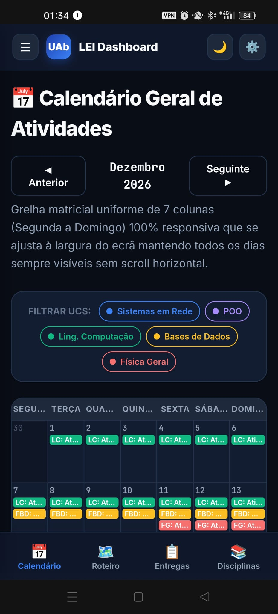
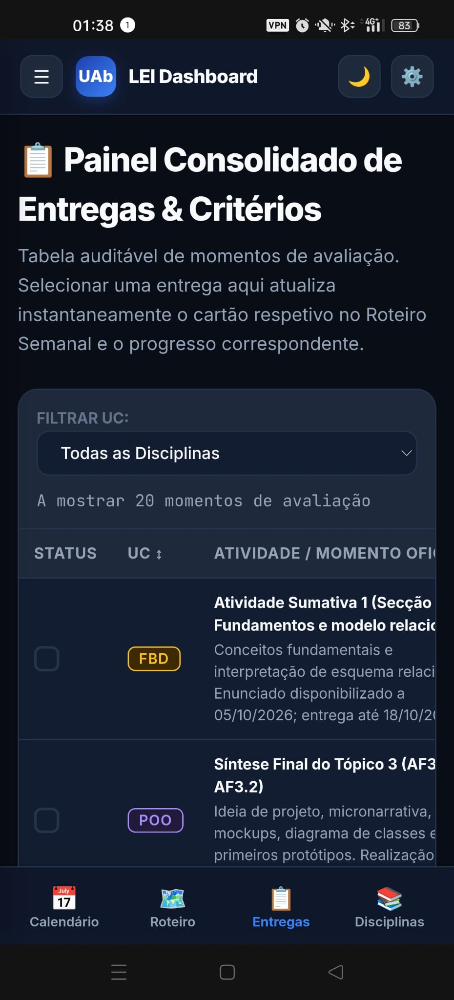
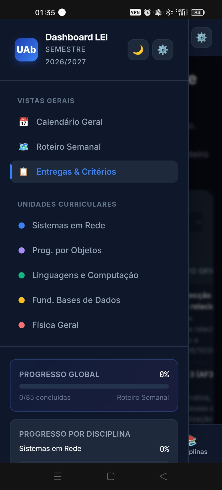

# 🎓 UAb Academic Dashboard Generator

Gerador de Dashboards Académicos de Alto Rendimento para a Licenciatura em Engenharia Informática da **Universidade Aberta (UAb)**.

A partir dos ficheiros PDF oficiais dos **Planos de Unidades Curriculares (PUCs)** e da **Master Prompt** incluída neste repositório, qualquer modelo de IA avançado gera um dashboard completo em ficheiro único autónomo (`index.html`), responsivo e com persistência local.

### 💻 Desktop View
| | |
| :---: | :---: |
|  |  |

### 📱 Mobile View
| | | | |
| :---: | :---: | :---: |  :---: |
|  |  |  |  |

---

## ⚡ Funcionalidades do Dashboard Gerado

* **Ficheiro Único Autónomo:** HTML5, CSS3 puro e Vanilla JavaScript — sem dependências pesadas externas.

* **Modo Dual Light / Dark:** Alternância suave com gravação da preferência em `localStorage`.

* **Mobile-First & Desktop:** Layout com sidebar fixa no desktop e bottom navigation bar ergonómica em dispositivos móveis.

* **Calendário Adaptativo (7 Colunas):** Sem scroll horizontal, cobrindo o semestre e isolando momentos com prazos críticos (anti-ruído visual).

* **Roteiro Semanal Expansível:** Organização por semanas com auto-scroll e expansão automática da semana corrente, tags de conceitos e destaques visuais de fecho.

* **Interligação Bidirecional:** Marcar tarefas no Roteiro Semanal reflete-se automaticamente no Painel de Entregas e atualiza as métricas de progresso global e por UC.

* **Notificações Toast Configuráveis:** 100% opacas, com botão de silenciamento definitivo e ajuste de dias de antecedência via modal (⚙️).

* **Páginas Dedicadas por UC:** Extração estruturada de Resultados de Aprendizagem (RA), critérios cumulativos de aprovação e bibliografia recomendada.

---

## 🚀 Como Usar

### Passo 1: Obter os PUCs do Semestre
Descarregue os ficheiros em formato PDF dos PUCs das disciplinas em que está inscrito a partir da PlataformAbERTA.

### Passo 2: Copiar a Master Prompt
Abra o ficheiro [`prompts/MASTER_PROMPT.md`](prompts/MASTER_PROMPT.md) deste repositório e copie todo o seu conteúdo.

### Passo 3: Submeter ao Modelo de IA
1. Aceda a um assistente de IA com suporte a ficheiros e contexto alargado (ex: Google AI Studio / Gemini Advanced, Claude ou ChatGPT Plus).
2. Anexe todos os ficheiros PDF dos PUCs.
3. Cole a Master Prompt na caixa de texto.
4. *(Opcional)* Se já tiver datas de Despacho Reitoral ou provas síncronas no Wiseflow, acrescente uma nota no final da mensagem:
   > *"Nota adicional: A prova síncrona da UC X realiza-se no dia DD/MM/AAAA às HH:MM."*
5. Submeta o pedido.

### Passo 4: Guardar e Abrir o Dashboard
1. Copie o bloco de código HTML gerado.
2. Guarde o conteúdo num ficheiro com o nome `index.html`.
3. Dê duplo clique no ficheiro para abrir em qualquer navegador (Chrome, Firefox, Safari, Edge) no PC ou telemóvel.

---

## 📂 Estrutura do Projeto

* `prompts/MASTER_PROMPT.md`: Diretrizes exaustivas de arquitetura, UI/UX e extração de regras académicas da UAb.
* `screenshots/`: Diretoria dedicada para alojar capturas de ecrã e imagens demonstrativas do dashboard.
* `templates/index.html`: Exemplo funcional pré-gerado para consulta imediata.

---

## 🛠️ Contribuições

Sugestões de melhoria na arquitetura de CSS, acessibilidade ou nos parâmetros da prompt são bem-vindas!
1. Faça um Fork do projeto.
2. Crie uma Branch (`git checkout -b feature/melhoria-ui`).
3. Submeta um Pull Request.

---

## 📄 Licença

Distribuído sob a licença MIT. Consulte `LICENSE` para mais informações.
